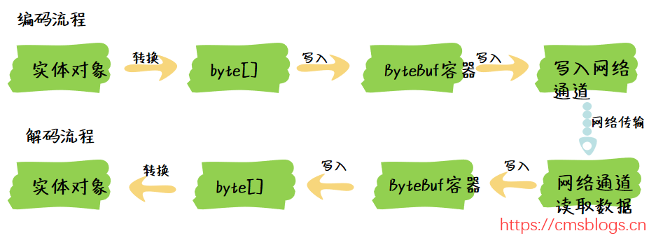
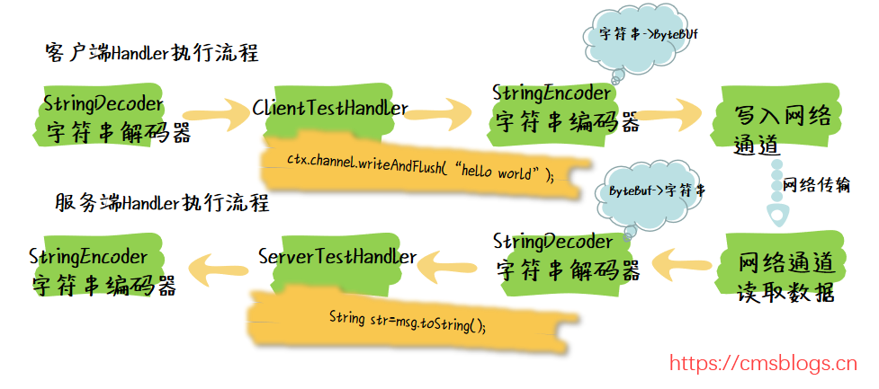
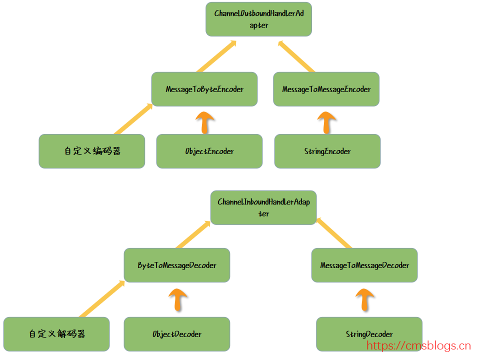

# Netty 就是解决两个系统之间互相通信的一个框架
用以快速开发高性能、高可靠性的网络 IO 程序。
Netty 只是对 Java 原生的通信框架进行了高度的封装
socket->nio->netty

Netty 比 Mina 使用起来更简单，如果上手只需要掌握模板代码 + 自定义 Handler 即可；

# 编码与解码
Netty 是面向 ByteBuf 来编程的，发送的内容会被编码成 ByteBuf，从 Channel 接受的数据流则被封装成了 ByteBuf

把编码和解码封装成两个独立的 Handler，并且加入到 ChannelPipeline 里面进行管理，让 Handler 只是专心的负责处理业务逻辑就好。
StringDecoder 和 StringEncoder 是 Netty 为我们提供的专门针对普通字符串的解码和编码器，使用起来非常的简单。

Netty 提供的几个核心编解码器的抽象类，主要是 MessageToByteEncoder、ByteToMessageDecoder、SimpleChannelInboundHandler。

SimpleChannelInboundHandler，它的核心作用是自动判断数据格式类型，并且转发给对应的 Handler 来处理。
SimpleChannelInboundHandler 使用非常简单，我们在继承这个类的时候，给他传递一个泛型参数，然后在 channelRead0 () 方法里面，我们不用再通过 if 逻辑来判断当前对象是否是本 handler 可以处理的对象，也不用强转，不用往下传递本 handler 处理不了的对象，这一切都已经交给父类 SimpleChannelInboundHandler 来实现了，我们只需要专注于我们要处理的业务逻辑即可。
