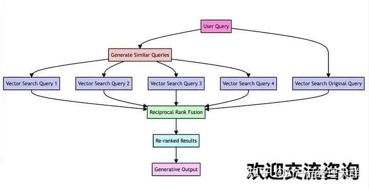
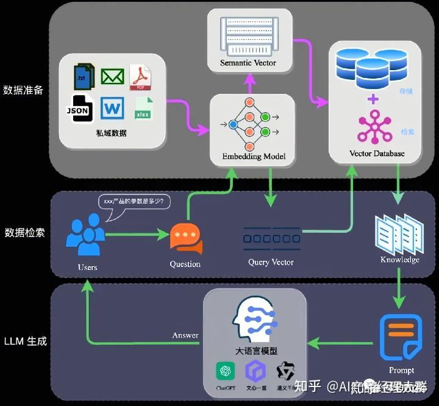

RAG 检索增强生成（Retrieval Augmented Generation）
理解起来不难，就是通过自有垂域数据库检索相关信息，然后合并成为提示模板，给大模型润色生成回答
但是当我们将大模型应用于实际业务场景时会发现，通用的基础大模型基本无法满足实际业务需求，主要有以下几方面原因：

知识的局限性：模型自身的知识完全源于它的训练数据，而现有的主流大模型（deepseek、文心一言、通义千问…）的训练集基本都是构建于网络公开的数据，对于一些实时性的、非公开的或离线的数据是无法获取到的。
幻觉问题：所有的AI模型的底层原理都是基于数学概率，其模型输出实质上是一系列数值运算，大模型也不例外，所以它经常会一本正经地胡说八道，尤其是在大模型自身不具备某一方面的知识或不擅长的场景。
数据安全性：对于企业来说，数据安全至关重要，没有企业愿意承担数据泄露的风险，将自身的私域数据上传第三方平台进行训练。这也导致完全依赖通用大模型自身能力的应用方案不得不在数据安全和效果方面进行取舍。

RAG（中文为检索增强生成） = 检索技术 + LLM 提示。

RAG 架构

完整的RAG应用流程主要包含两个阶段：
数据准备阶段：数据提取——>文本分割——>向量化（embedding）——>数据入库
应用阶段：用户提问——>数据检索（召回）->重排（reranking）和过滤（filtering）——>注入Prompt——>LLM生成答案

向量化是一个将文本数据转化为向量矩阵的过程，该过程会直接影响到后续检索的效果。目前常见的embedding模型：ChatGPT-Embedding
数据向量化后构建索引，并写入数据库的过程可以概述为数据入库过程，适用于RAG场景的数据库包括：FAISS、Chromadb、ES、milvus等。

Prompt作为大模型的直接输入，是影响模型输出准确率的关键因素之一。在RAG场景中，Prompt一般包括任务描述、背景知识（检索得到）、任务指令（一般是用户提问）等，根据任务场景和大模型性能，也可以在Prompt中适当加入其他指令优化大模型的输出。一个简单知识问答场景的Prompt如下所示：

【任务描述】
假如你是一个专业的客服机器人，请参考【背景知识】，回
【背景知识】
{content} // 数据检索得到的相关文本
【问题】
石头扫地机器人P10的续航时间是多久？
