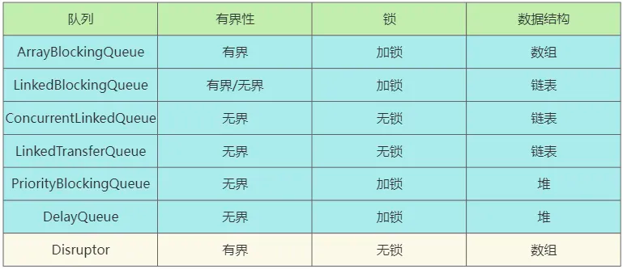

Disruptor 是英国外汇交易公司 LMAX 开发的一个高性能的内存队列。

1.定义事件数据载体，需支持快速序列化和反序列化
@Data
@NoArgsConstructor
public class OrderEvent {
private String orderId;
private BigDecimal amount;
}
2.事件工厂实现‌
public class OrderEventFactory implements EventFactory<OrderEvent> {
@Override
public OrderEvent newInstance() { return new OrderEvent(); }
}

